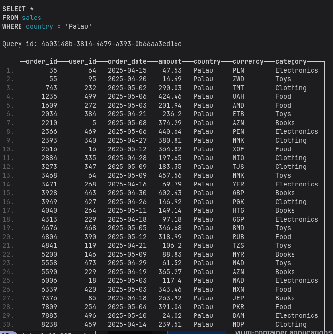
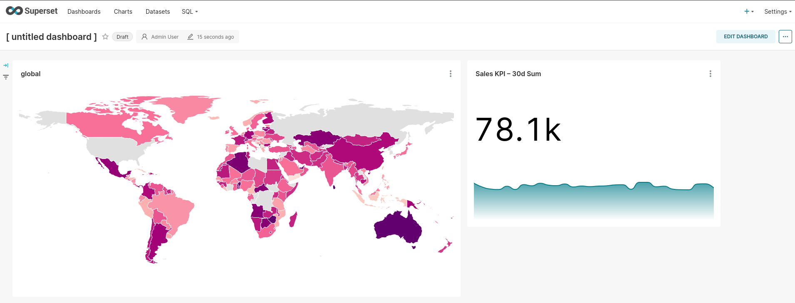

# 📊 Sales Dashboard with ClickHouse & Superset

A data analytics project to visualize daily sales using ClickHouse for storage and Apache Superset for creating interactive dashboards and KPIs.

---

## 🧩 Part 1: Project Overview

This project includes:

- Generating fake sales data using Python and Faker
- Loading data into a high-performance ClickHouse database
- Creating sales visualizations and KPIs in Apache Superset (e.g., daily totals, yesterday’s sales, trends, etc.)

The dataset includes columns like:  
`order_id`, `user_id`, `order_date`, `amount`, `country`, `currency`, `category`.

---

## ⚙️ Part 2: How to Run

### 1. Generate and Load Data into ClickHouse

Run the docker compose:

```bash
docker compose up --build  
````

This script will generate fake data and insert it into a `sales` table inside ClickHouse at:

```
/var/lib/clickhouse/user_files/data/sales.csv
```

### 2. Connect Superset to ClickHouse

* Go to **Data → Databases** in Superset
* Click **+ Database**, and use the following SQLAlchemy URI:
```bash
clickhouse+native://default:@clickhouse:9000/default
```


* After connecting, add the `sales` table from the schema browser.

---

## 📈 Part 3: Dashboards and Visuals

### 🧮 KPI

1. **Trendline - Last 30 Days of Sales**
   Show a daily trend over the last 30 days:

   ```sql
   SELECT
     toStartOfDay(order_date) AS period,
     SUM(amount) AS total_sales
   FROM sales
   WHERE order_date >= today() - INTERVAL 30 DAY
   GROUP BY period
   ORDER BY period
   ```

### 🎨 Suggested Dashboard Colors (Hex)

* Primary Blue (KPIs): `#007BFF`
* Growth Green: `#28A745`
* Drop Red: `#DC3545`
* Light Background: `#F8F9FA`

---

## 🔗 View Your Dashboard

After logging into Superset:

* Navigate to `Dashboards → + Dashboard → Add Chart`
* Choose charts like: **Big Number**, **Line Chart**, **Bar Chart**, etc.

If you're running locally, visit:

```
http://localhost:8088/superset/dashboard
```

---

## 📦 Tech Stack

* Python 3.10
* ClickHouse 25.x
* Apache Superset
* Faker (for generating synthetic sales data)

---

## 🔒 Security Note

ClickHouse user files (e.g., CSV) are accessible under `/var/lib/clickhouse/user_files`. Make sure proper permissions are in place in a production environment.


